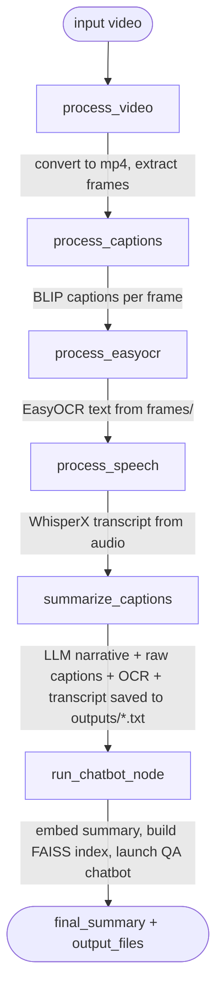

# Video Summarizer

A video-understanding pipeline that turns a raw video file into a written summary and a
question-answering chatbot. It samples frames from the video, captions each frame with a
vision-language model (BLIP), pulls any on-screen text with OCR (EasyOCR), asks an LLM (Groq /
Llama 3) to turn the raw captions into a coherent narrative, and then indexes that narrative in a
FAISS vector store so you can ask follow-up questions about the video in natural language.

The pipeline is orchestrated as a directed graph with [LangGraph](https://github.com/langchain-ai/langgraph),
and can be driven either from the command line or from a small Streamlit UI.

## Features

- **Frame extraction** — samples one frame every N frames from the input video (`cv2`).
- **Scene captioning** — captions each frame with `Salesforce/blip-image-captioning-base`,
  de-duplicating near-identical consecutive captions.
- **On-screen text (OCR)** — extracts and filters text from the frames with `EasyOCR`
  (strips prices, watermarks, boilerplate, etc.).
- **Speech-to-text** — transcribes the video's audio track with `WhisperX`.
- **LLM summarization** — merges captions + OCR text + speech transcript into one narrative using Groq's
  `llama3-8b-8192` via `langchain_groq`.
- **RAG chatbot** — embeds the summary with a `sentence-transformers` model, stores it in
  FAISS, and answers questions about the video with a `MultiQueryRetriever` + `RetrievalQA` chain.
- **Two front doors** — a CLI (`run.py`) and a Streamlit app (`run_app.py`).

## Architecture

The pipeline is a single linear [LangGraph](https://github.com/langchain-ai/langgraph) `StateGraph`
(see [edges.py](edges.py)) built around one shared, validated state object, `VideoState`
(see [state.py](state.py)). Each node takes the current state and returns only the fields it
updated.



> [!NOTE]
> [`workflow.mmd`](workflow.mmd) is a `langgraph`-auto-exported version of this same graph (via
> `app.get_graph().draw_mermaid()`), kept in sync with [edges.py](edges.py), the source of truth
> for the actual graph.

### Nodes ([nodes.py](nodes.py))

| Node | Input it needs | What it does | Backing tool |
|---|---|---|---|
| `process_video` | `input_video` | Re-encodes the video to `.mp4` and samples frames every 30 frames into `frames/` | [tools/blip_tools.py](tools/blip_tools.py) |
| `process_captions` | `frames` | Runs BLIP image captioning on each frame, skipping frames whose caption is too similar to the previous one | [tools/blip_tools.py](tools/blip_tools.py) |
| `process_easyocr` | frames on disk (`frames/`) | Runs EasyOCR over the frame images and filters out noise (prices, URLs, copyright text, short tokens) | [tools/easy_ocr.py](tools/easy_ocr.py) |
| `process_speech` | `converted_video` (or `input_video`) | Transcribes the video's audio track with WhisperX | [tools/speech_to_text.py](tools/speech_to_text.py) |
| `summarize_captions` | `captions`, `extracted_text`, `speech_text` | Sends the raw captions to Groq's Llama 3 to produce a narrative summary, then writes raw captions + LLM summary + OCR text + speech transcript to `outputs/*_llm_summary_full_*.txt` | [tools/summarize_tools.py](tools/summarize_tools.py) |
| `run_chatbot_node` | `scene_summary` | Embeds the summary, builds/saves a FAISS index, builds a `RetrievalQA` chain, then opens an interactive terminal Q&A loop over the video | [tools/rag.py](tools/rag.py) |

### State ([state.py](state.py))

`VideoState` is a Pydantic model that flows through every node and accumulates results:

```
input_video, converted_video, frames[], captions[(frame, caption)],
extracted_text, speech_text, scene_summary, text_summary, final_summary, output_files{}
```

Validators ensure any path field that's set actually exists on disk, so a failed upstream step
surfaces immediately instead of silently propagating a bad path.

### Entry points

- **[run.py](run.py)** — CLI: `python run.py <video_path>`. Validates the file, invokes the graph,
  and prints the final `VideoState` plus the paths of everything written to `outputs/`.
- **[run_app.py](run_app.py)** — Streamlit UI: upload a video, preview it, click "Run Pipeline",
  and see the resulting JSON state and output file links in the browser.

> [!WARNING]
> Both entry points invoke the *same* graph, which ends in `run_chatbot_node` — a **blocking
> terminal `input()` loop**. From the CLI this opens an interactive chat after the summary is
> printed. From the Streamlit app this will hang the web request, since there's no terminal to
> type into. If you want a non-interactive web run, drop `run_chatbot_node` from the graph (or add
> a separate graph without it) before invoking from Streamlit.

## Project structure

```
.
├── run.py                 # CLI entry point
├── run_app.py              # Streamlit UI entry point
├── state.py                # VideoState — the shared pipeline state
├── nodes.py                 # Node functions (one per pipeline stage)
├── edges.py                 # LangGraph StateGraph wiring (the real graph)
├── workflow.mmd             # Auto-exported graph diagram (see note above)
├── tools/
│   ├── blip_tools.py        # Video conversion, frame extraction, BLIP captioning
│   ├── easy_ocr.py          # EasyOCR text extraction + noise filtering
│   ├── speech_to_text.py    # WhisperX speech-to-text transcription
│   ├── summarize_tools.py   # LLM narrative summary + writing outputs/*.txt
│   └── rag.py               # FAISS vectorstore + RetrievalQA chatbot
├── vectorstore/
│   └── vectorstore.py       # Standalone FAISS build/query helper
├── frames/, captioned_frames/  # Generated frame images (created at runtime)
├── outputs/                 # Generated summaries (*.txt) and chatbot.ready flag
└── faiss_store/              # Generated FAISS index (created at runtime)
```

### Unrelated scaffold files

[main.py](main.py), [extractor.py](extractor.py), [dataset.py](dataset.py), [llm.py](llm.py),
[utils.py](utils.py), and [models/](models/) belong to a separate, unfinished
invoice/document-extraction experiment (Donut / OCR-based key-value extraction) and are **not**
part of the video summarization pipeline described above. They're not imported by `run.py`,
`run_app.py`, or any pipeline module.

## Setup

Requires Python ≥ 3.12 and a [Groq API key](https://console.groq.com) (used for the summarization
and chatbot LLM calls).

```bash
# using uv (this repo ships a uv.lock)
uv sync

echo "GROQ_API_KEY=your_key_here" > .env
```

`pyproject.toml` lists every dependency the video pipeline needs — `opencv-python`, `langgraph`,
`langchain`, `langchain-groq`, `langchain-community`, `sentence-transformers`, `faiss-cpu`,
`easyocr`, `whisperx`, `streamlit`, `python-dotenv`, `pydantic` — alongside the unrelated
invoice-extraction scaffold's deps (`pdf2image`, `pytesseract`, `datasets`, etc., see
[Unrelated scaffold files](#unrelated-scaffold-files)).

> [!NOTE]
> `whisperx` needs `ffmpeg`. Instead of a system/apt install, this repo bundles a portable ffmpeg
> binary via `imageio-ffmpeg` and wires it up in [tools/speech_to_text.py](tools/speech_to_text.py)
> — no root access required. That module also neutralizes a known crash where an installed-but-
> non-functional `torchcodec` (a `whisperx`/`pyannote-audio` dependency) otherwise takes down
> `sentence_transformers`' import at process startup.

## Usage

**CLI:**

```bash
python run.py path/to/video.mp4
```

Prints the final pipeline state as JSON and the paths of any generated output files, then drops
into an interactive terminal chatbot for asking questions about the video (type `exit` to quit).

**Streamlit app:**

```bash
streamlit run run_app.py
```

Upload a video in the browser and click **Run Pipeline** (see the warning above about the
blocking chatbot step).

## Outputs

- `frames/` — sampled frame images (`frame_<n>.jpg`, one every 30 frames by default)
- `outputs/<video>_llm_summary_full_<timestamp>.txt` — raw BLIP captions, LLM-formatted summary,
  raw OCR text, and WhisperX speech transcript for one run
- `outputs/chatbot.ready`, `outputs/chatbot_error.log` — chatbot init status/errors
- `faiss_store/` — persisted FAISS index + `metadata.json` (summary mtime, used to decide whether
  to rebuild the index on the next run)
